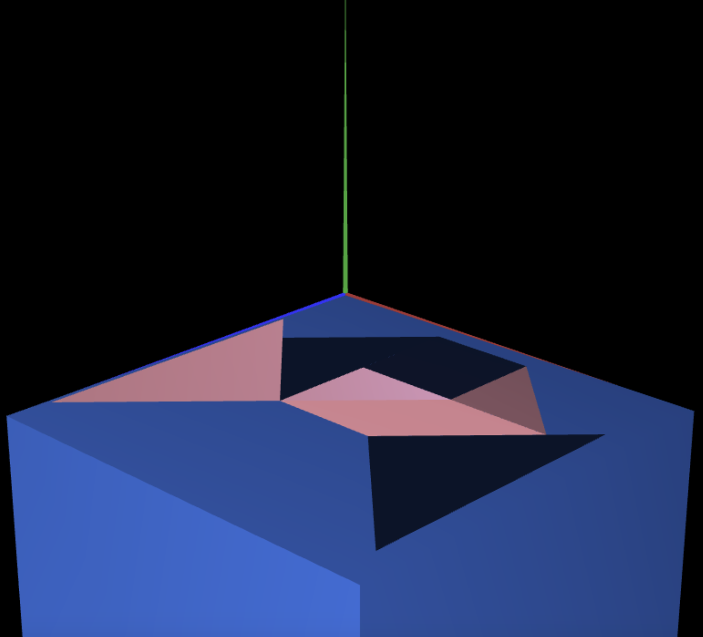

# CG 2023/2024

## Group T09G03

## TP 2 Notes

From these exercises, we learned how to manipulate geometric transformations in a 3D scene using WebGL.
- In the first exercise, we utilized matrices to position Tangram pieces in the XY plane, created a MyTangram class to encapsulate these objects, and implemented display functions. 

- In the second exercise, we introduced a unit cube (MyUnitCube) centered at the origin, applying transformations to position it as a base for the Tangram figure. 

- The third exercise involved creating a unit cube using planes and a MyQuad class, allowing for a composite cube (MyUnitCubeQuad). The same geometric transformations were applied to integrate it into the scene, providing a comprehensive understanding of 3D geometry and transformation techniques in WebGL.

