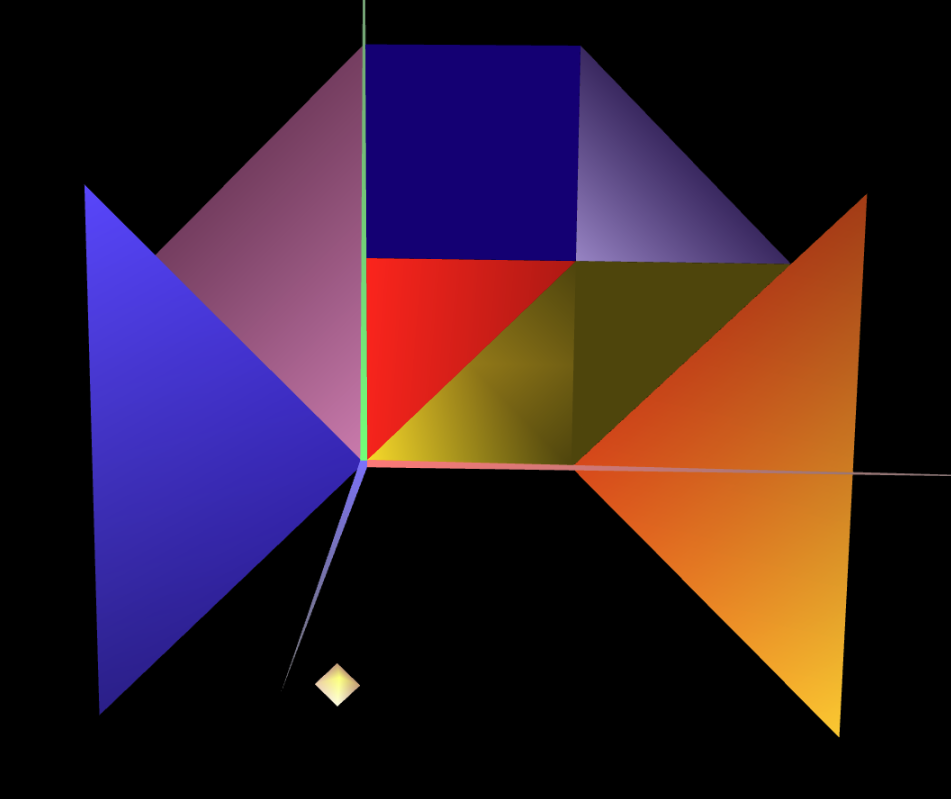

# CG 2023/2024

## Group T09G03

## TP 3 Notes

In Exercise 1, we used the unit cube implemented in previous classes to create all the necessary normals so that the calculated lighting would make sense according to the angle of incidence of the light and the viewing angle. We created a material with a wood-like color and a low specular component.

Then we proceeded to appply several materials with a high specular component to the figures present in the tangram.

In exercise 2, in order to draw the prism we draw the vertices by dividing a trignometric circle by the number of sides. However, in order to have multiple normals in the "same" vertex we need to duplicate the vertices.

In exercise 3, we take the prism and make the normals prependicular to the vertex. With this, we can reduce the number of vertices because the normals are shared. We can notice that the lighting between the cylinder and the prism are different and the cylinder lighting gives a sensation that it's "more" round.
