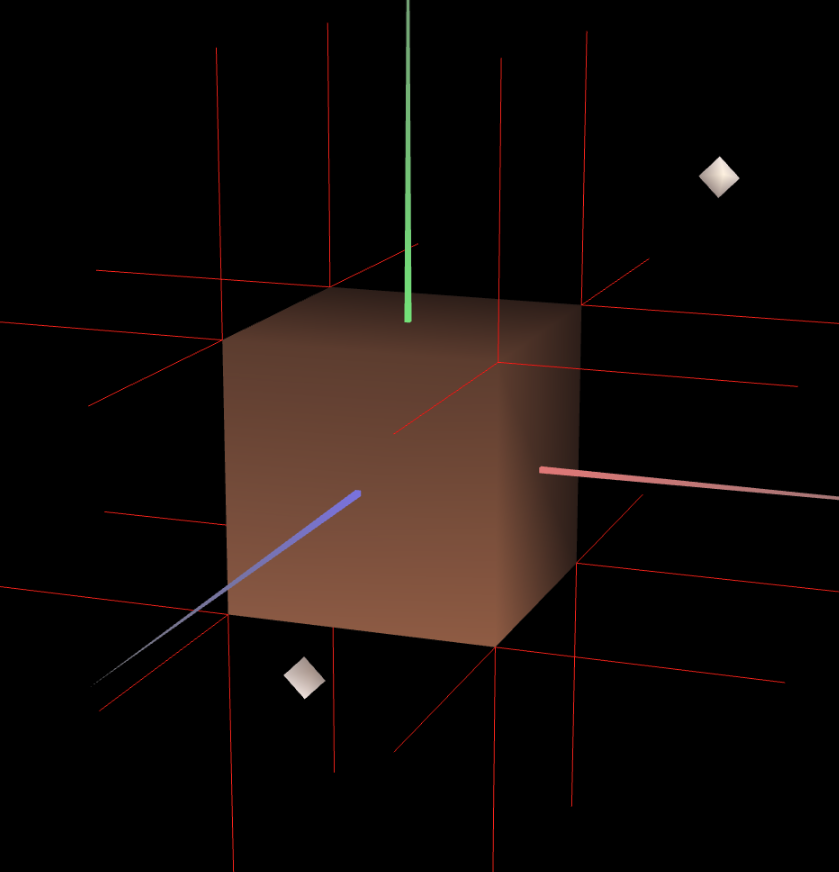

# CG 2023/2024

## Group T09G03

## TP 3 Notes

In Exercise 1, we used the unit cube implemented in previous classes to create all the necessary normals so that the calculated lighting would make sense according to the angle of incidence of the light and the viewing angle. We created a material with a wood-like color and a low specular component.

Then we proceeded to appply several materials with a high specular component to the figures present in the tangram.

